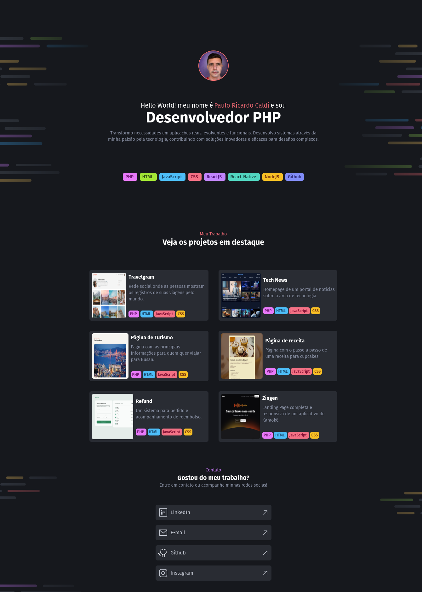

<h1 align="center" style="text-align: center;">
  📄 Portfólio Dev
</h1>

    

<h2 id="project">📁 Projeto</h2>

Projeto de um portfólio, com alguns exemplos de projetos e redes sociais desenvolvido em php, utilizando tailwind.

<h2 id="technologies">💻 Tecnologias</h2>

Este projeto foi desenvolvido com as seguintes tecnologias:

- PHP
- HTML
- TailWind

<h2 id="site">⭐ Site</h2>

O site está disponível no seguinte endereço [aqui](https://portfoliodevv.netlify.app).

## 👨🏻‍💻 Autor

<a href="https://github.com/pcaldi">
 
  
 <b>Paulo Caldi</b></a> <a href="https://github.com/pcaldi" title="emoji">🙋🏻</a>
  

---

